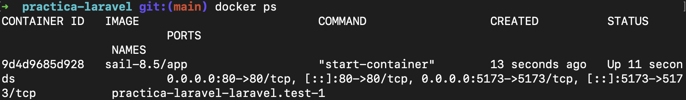
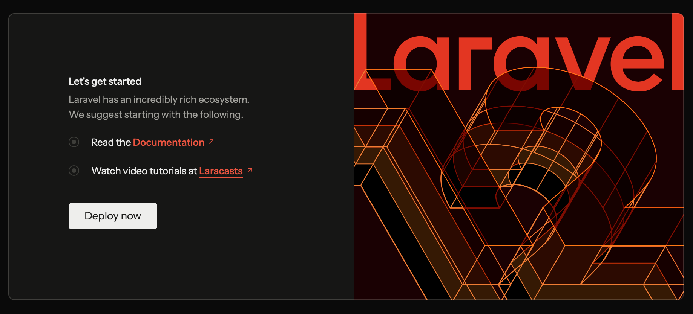

# Práctica: Entorno de Desarrollo Laravel con Docker

Este proyecto despliega un entorno de desarrollo para Laravel utilizando **Laravel Sail** y **Docker**.

## Requisitos
* Docker Desktop (en ejecución)
* Git
* Terminal (Bash/Zsh)

## Instalación

1. **Descargar el proyecto:**

Se utiliza el instalador oficial para generar la estructura sin necesidad de tener PHP instalado localmente:

```bash
curl -s "https://laravel.build/practica-laravel" | bash
```

2. **Arrancar el entorno:**

```bash
./vendor/bin/sail up -d
```

Esto inicia los servicios (Nginx, MySQL, Redis) en segundo plano.

## Comandos Útiles

### Ver estado de contenedores:

```bash
docker ps
```



### Migrar base de datos:

```bash
./vendor/bin/sail artisan migrate
```


### Parar los servicios:

```bash
./vendor/bin/sail stop
```

## Acceso

* **Web:** http://localhost (Página de bienvenida de Laravel)



---

*Práctica realizada desplegando Laravel con Docker Desktop en macOS.*
